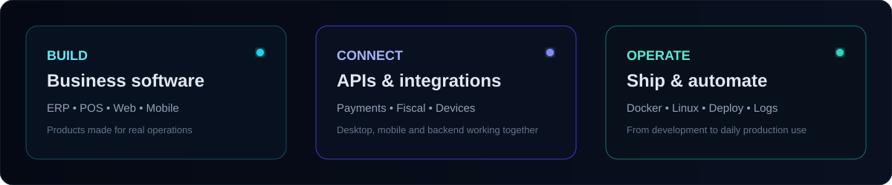
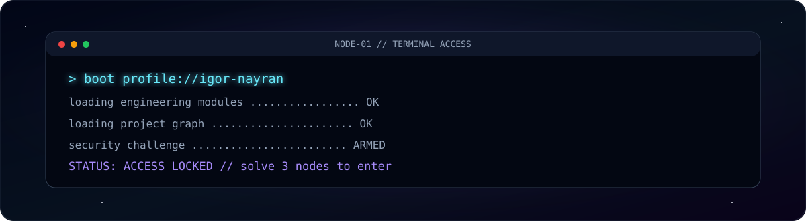
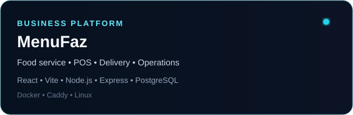
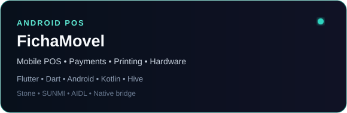
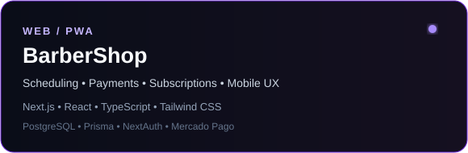
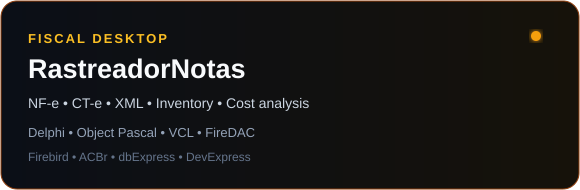
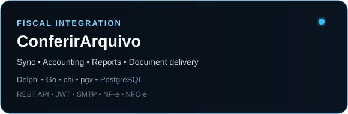
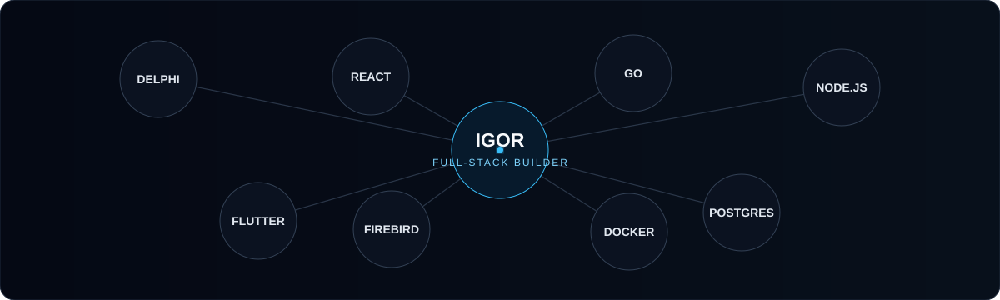
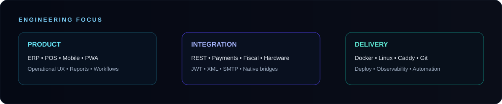

<div align="center">


<br/>

**Sistemas comerciais • ERP • PDV • Mobile • APIs • Fiscal • Automação**  
*Business software • ERP • POS • Mobile • APIs • Fiscal • Automation*

<br/>


<br/>

[](#terminal-access-game)
[](#projetos-em-destaque--featured-projects)
[](#tech-galaxy)
[](#engineering-focus)
[](#atividade--activity)

</div>


## Sobre mim / About me

Desenvolvedor focado em **software que resolve problemas reais de operação** — sistemas comerciais, PDV, ERP, mobile, integrações, APIs, automação e rotinas fiscais.

*Developer focused on software that solves real operational problems — business systems, POS, ERP, mobile, integrations, APIs, automation and fiscal workflows.*



<details>
<summary><strong>✦ Como eu penso produto / How I approach product engineering</strong></summary>
<br/>

- **Build:** transformar necessidade operacional em software utilizável no dia a dia.
- **Connect:** integrar desktop, mobile, APIs, pagamentos, fiscal e dispositivos.
- **Operate:** pensar também em banco, deploy, segurança, logs e continuidade operacional.

*I focus on the whole product path: building the application, connecting systems and keeping the solution reliable in real operation.*

</details>


## Terminal Access Game

<div align="center">

</div>

> **Missão:** atravesse três nós do sistema e libere o acesso.  
> *Mission: solve three system nodes and unlock access.*

<details open>
<summary><strong>▶ START GAME // iniciar desafio</strong></summary>
<br/>

### NODE 01 — API GATEWAY

O cliente envia a mesma requisição de pagamento duas vezes por falha de rede. Qual estratégia evita cobrança duplicada?

<details>
<summary><code>[ A ] Confiar apenas no timestamp do cliente</code></summary>
<br/>

**ACCESS DENIED.** O relógio do cliente não garante unicidade nem processamento único.

`status: FAIL` · tente outra rota.

</details>

<details>
<summary><code>[ B ] Usar uma chave de idempotência persistida no backend</code></summary>
<br/>

**NODE 01 UNLOCKED.** A mesma operação pode ser reconhecida e reaproveitada sem executar novamente.

`status: PASS` · prossiga para o Node 02 abaixo.

### NODE 02 — DATABASE CORE

Você precisa garantir que dados de duas empresas nunca sejam misturados em consultas de uma API multiempresa. Qual abordagem é mais segura?

<details>
<summary><code>[ A ] Receber companyId livremente do frontend e confiar nele</code></summary>
<br/>

**ACCESS DENIED.** Identificadores enviados pelo cliente precisam ser validados contra a identidade autenticada.

</details>

<details>
<summary><code>[ B ] Derivar o tenant da sessão/token e aplicar o filtro também no backend</code></summary>
<br/>

**NODE 02 UNLOCKED.** O isolamento passa a fazer parte da autorização, não apenas da interface.

`status: PASS` · último nó liberado.

### NODE 03 — FISCAL CORE

Um serviço recebe XML fiscal, gera relatórios e permite download posterior. O que deve permanecer fora de logs públicos?

<details>
<summary><code>[ A ] Tokens, credenciais, dados de clientes e conteúdo fiscal sensível</code></summary>
<br/>

## ACCESS GRANTED

```text
NODE-01  API GATEWAY       [PASS]
NODE-02  DATABASE CORE     [PASS]
NODE-03  FISCAL CORE       [PASS]

IDENTITY: SOFTWARE BUILDER
CLEARANCE: REAL-WORLD SYSTEMS
STATUS: ACCESS GRANTED
```

Você chegou ao núcleo. Agora explore os projetos abaixo.

*You reached the core. Continue through the projects below.*

</details>

<details>
<summary><code>[ B ] Tudo, desde que o servidor esteja em produção</code></summary>
<br/>

**ACCESS DENIED.** Produção não transforma informação sensível em informação segura para log.

</details>

</details>

<details>
<summary><code>[ C ] Repetir a operação e corrigir manualmente depois</code></summary>
<br/>

**ACCESS DENIED.** Sistemas de pagamento precisam evitar duplicidade antes de criar inconsistência financeira.

</details>

</details>

</details>


## Projetos em destaque / Featured projects

<div align="center">
<a href="https://github.com/IgorNayran/MenuFaz-Showcase"></a>
<a href="https://github.com/IgorNayran/FichaMovel-Showcase"></a>
<br/>
<a href="https://github.com/IgorNayran/BarberShop-Showcase"></a>
<a href="https://github.com/IgorNayran/RastreadorNotas-Showcase"></a>
<br/>
<a href="https://github.com/IgorNayran/ConferirArquivo-Showcase"></a>
</div>

> Os códigos-fonte principais permanecem privados. Os cards acima levam às vitrines públicas dos projetos.  
> *The main source repositories remain private. The cards above open the public project showcases.*

<details>
<summary><strong>🚀 MenuFaz — food service, POS & operations</strong></summary>
<br/>
Plataforma comercial para delivery, balcão, mesas, comandas, financeiro, relatórios, estoque, impressão e dispositivos.

`React` · `Vite` · `JavaScript` · `Node.js` · `Express` · `PostgreSQL` · `Docker` · `Caddy`

[→ Abrir showcase / Open showcase](https://github.com/IgorNayran/MenuFaz-Showcase)
</details>

<details>
<summary><strong>📱 FichaMovel — Android POS & device integration</strong></summary>
<br/>
Aplicativo Android/POS com pagamentos Stone, impressão SUNMI, bridge nativa Kotlin, persistência local e integração com o ecossistema MenuFaz.

`Flutter` · `Dart` · `Android` · `Kotlin` · `Hive` · `AIDL`

[→ Abrir showcase / Open showcase](https://github.com/IgorNayran/FichaMovel-Showcase)
</details>

<details>
<summary><strong>✂️ BarberShop — web/PWA business platform</strong></summary>
<br/>
Plataforma de agendamentos, clientes, pagamentos, assinaturas e gestão operacional, preparada para web e mobile.

`Next.js` · `React` · `TypeScript` · `Tailwind CSS` · `PostgreSQL` · `Prisma` · `NextAuth`

[→ Abrir showcase / Open showcase](https://github.com/IgorNayran/BarberShop-Showcase)
</details>

<details>
<summary><strong>🧾 RastreadorNotas — fiscal desktop engineering</strong></summary>
<br/>
Aplicação desktop fiscal para NF-e, CT-e, XML, estoque, custos e rotinas comerciais com ecossistema ACBr.

`Delphi` · `Object Pascal` · `VCL` · `FireDAC` · `Firebird` · `ACBr`

[→ Abrir showcase / Open showcase](https://github.com/IgorNayran/RastreadorNotas-Showcase)
</details>

<details>
<summary><strong>🛰️ ConferirArquivo — fiscal sync & accounting automation</strong></summary>
<br/>
Sincronização de documentos fiscais, automação contábil, relatórios, downloads e integração entre agentes desktop e serviços centralizados.

`Delphi` · `Go` · `chi` · `pgx` · `PostgreSQL` · `REST API`

[→ Abrir showcase / Open showcase](https://github.com/IgorNayran/ConferirArquivo-Showcase)
</details>


## Tech Galaxy

<div align="center">

</div>

<details open>
<summary><strong>🖥️ Aplicações / Applications</strong></summary>
<br/>


</details>

<details>
<summary><strong>⚙️ Backend, dados e infraestrutura / Backend, data & infrastructure</strong></summary>
<br/>


</details>

<details>
<summary><strong>🧩 Fiscal, pagamentos e integrações / Fiscal, payments & integrations</strong></summary>
<br/>


</details>


## Engineering Focus



<details open>
<summary><strong>🧠 O que eu costumo resolver / What I usually solve</strong></summary>
<br/>

**Produto:** ERP, POS, mobile, PWA, relatórios e fluxos operacionais.  
**Integração:** REST APIs, pagamentos, fiscal brasileiro, XML, hardware Android e autenticação.  
**Entrega:** Docker, Linux, Caddy, Git, deploy, logs, observabilidade e automação.

*Product engineering, integrations and production delivery — from desktop and mobile clients to APIs, databases and deployment.*
</details>


## Atividade / Activity

<div align="center">
<picture>
  <source media="(prefers-color-scheme: dark)" srcset="https://raw.githubusercontent.com/IgorNayran/IgorNayran/output/github-contribution-grid-snake-dark.svg" />
  <source media="(prefers-color-scheme: light)" srcset="https://raw.githubusercontent.com/IgorNayran/IgorNayran/output/github-contribution-grid-snake.svg" />
  
</picture>
</div>

<details>
<summary><strong>✦ Sobre esta animação / About this animation</strong></summary>
<br/>
A animação usa o gráfico público de contribuições do GitHub e é regenerada automaticamente pelo próprio repositório de perfil.

*The animation is generated from the public GitHub contribution grid and refreshed automatically by this profile repository.*
</details>


<div align="center">

### Áreas de atuação / Focus areas

`ERP` · `PDV / POS` · `Sistemas comerciais` · `Mobile` · `REST APIs` · `Integrações` · `Automação` · `Fiscal` · `Pagamentos` · `Relatórios` · `Deploy`

<br/>


</div>
